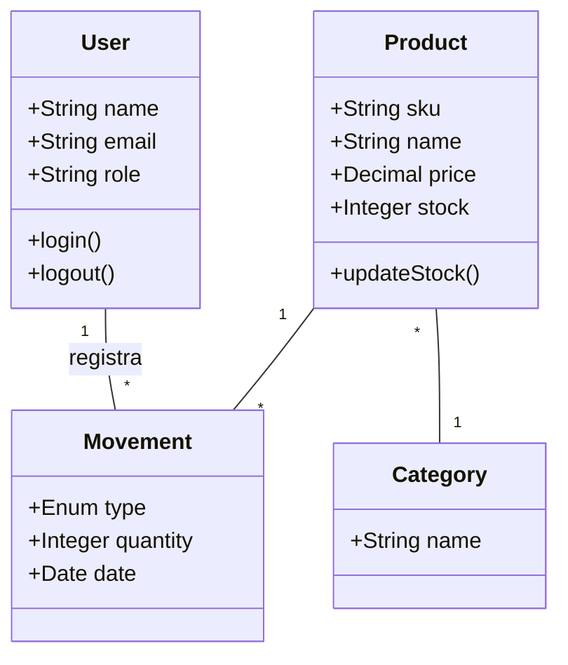

# Diagrama de Clases

Este diagrama representa la lógica de negocio y la estructura de objetos del sistema.

## Capas del Sistema

### Data Layer (Models)
- **User**: Maneja la autenticación y perfiles.
- **Product**: Representa los artículos del inventario.
- **Category**: Agrupación lógica de productos.
- **InventoryMovement**: Registro histórico de cambios en el stock.

### Repository Layer
- **UserRepository**: Abstracción para acceso a datos de usuarios.
- **ProductRepository**: Abstracción para CRUD de productos.
- **MovementRepository**: Abstracción para registro de movimientos.

### Presentation Layer (Controllers)
- **AuthController**: Gestiona el login y sesión.
- **ProductController**: Operaciones de catálogo.
- **StockController**: Operaciones de inventario en tiempo real.
- **AdminController**: Gestión de usuarios (Solo Admin).
- **ReportController**: Generación de PDFs.

## Diagrama (Pseudocódigo Mermaid)

