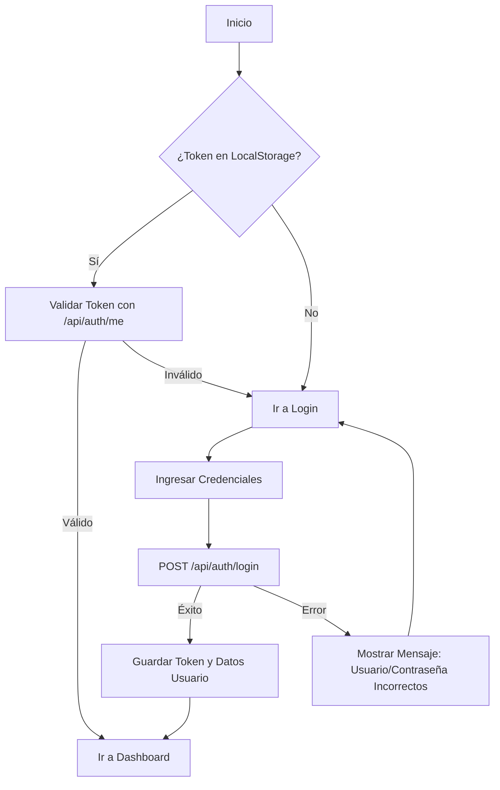
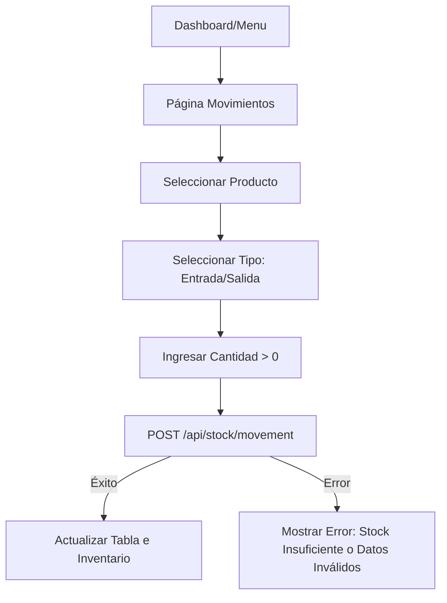
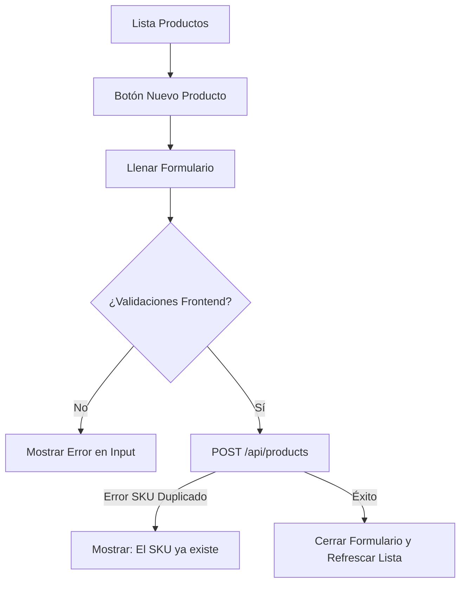

# Diagrama de Flujo del Sistema

## 1. Flujo de Autenticación

```mermaid
graph TD
    A[Inicio] --> B{¿Token en LocalStorage?}
    B -- Sí --> C[Validar Token con /api/auth/me]
    C -- Válido --> D[Ir a Dashboard]
    C -- Inválido --> E[Ir a Login]
    B -- No --> E
    E --> F[Ingresar Credenciales]
    F --> G[POST /api/auth/login]
    G -- Éxito --> H[Guardar Token y Datos Usuario]
    H --> D
    G -- Error --> I[Mostrar Mensaje: Usuario/Contraseña Incorrectos]
    I --> E
```

## 2. Registro de Movimientos de Stock

```mermaid
graph TD
    A[Dashboard/Menu] --> B[Página Movimientos]
    B --> C[Seleccionar Producto]
    C --> D[Seleccionar Tipo: Entrada/Salida]
    D --> E[Ingresar Cantidad > 0]
    E --> F[POST /api/stock/movement]
    F -- Éxito --> G[Actualizar Tabla e Inventario]
    F -- Error --> H[Mostrar Error: Stock Insuficiente o Datos Inválidos]
```

## 3. Gestión de Productos (Admin)

```mermaid
graph TD
    A[Lista Productos] --> B[Botón Nuevo Producto]
    B --> C[Llenar Formulario]
    C --> D{¿Validaciones Frontend?}
    D -- No --> E[Mostrar Error en Input]
    D -- Sí --> F[POST /api/products]
    F -- Error SKU Duplicado --> G[Mostrar: El SKU ya existe]
    F -- Éxito --> H[Cerrar Formulario y Refrescar Lista]
```
